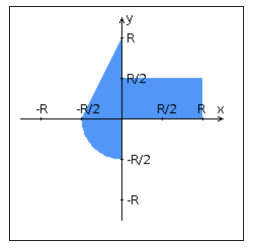

Приложение, которое осуществляет проверку попадания точки в заданную область на координатной плоскости.

Уровень back-end должен быть основан на Spring.
Уровень front-end должен быть построен на React + Redux (необходимо использовать ES6 и JSX) с использованием набора компонентов Belle
Взаимодействие между уровнями back-end и front-end должно быть организовано посредством REST API.

Набор полей ввода для задания координат точки и радиуса области в соответствии с вариантом задания: Spinner (-3 ... 5) для координаты по оси X, TextInput (-3 ... 3) для координаты по оси Y, и Spinner (-3 ... 5) для задания радиуса области. Если поле ввода допускает ввод заведомо некорректных данных (таких, например, как буквы в координатах точки или отрицательный радиус), то приложение должно осуществлять их валидацию.
Динамически обновляемую картинку, изображающую область на координатной плоскости в соответствии с номером варианта и точки, координаты которых были заданы пользователем. Клик по картинке должен инициировать сценарий, осуществляющий определение координат новой точки и отправку их на сервер для проверки её попадания в область. Цвет точек должен зависить от факта попадания / непопадания в область. Смена радиуса также должна инициировать перерисовку картинки.
Таблицу со списком результатов предыдущих проверок.
Ссылку, по которой аутентифицированный пользователь может закрыть свою сессию и вернуться на стартовую страницу приложения.
Дополнительные требования к приложению:

Все результаты проверки должны сохраняться в базе данных под управлением СУБД PostgreSQL.
Для доступа к БД необходимо использовать Spring Data.
